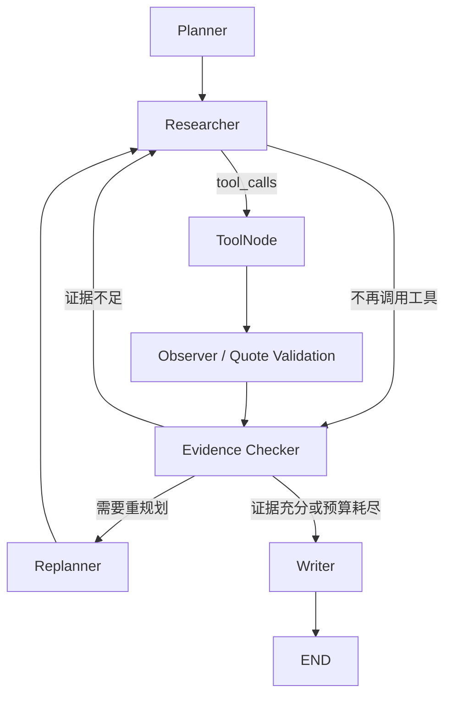

# Novel Agent

这是一个用于学习长链路 Agent 工作原理的小说证据型解读 Demo。输入一份本地小说 TXT 和一个开放式问题，Agent 会规划调查任务、搜索原文、读取上下文、记录证据、检查证据缺口、按需重规划，最后输出带原文位置的分析。

本项目刻意保持单 Agent 架构。重点不是做一个完整阅读产品，而是观察：

```text
状态 → 模型决策 → 工具调用 → 观察结果 → 更新证据 → 检查/重规划 → 结束
```

详细的渐进式设计见 [novel-agent-progressive-plan.md](novel-agent-progressive-plan.md)。

## 当前能力

- 读取 UTF-8、UTF-8-SIG、UTF-16、GB18030 等常见 TXT。
- 识别阿拉伯数字、中文数字、英文、特殊名称和无编号短标题。
- 支持同一本小说混用多种标题格式。
- 标题识别不可靠时自动按段落和长度降级切分。
- 所有 Chunk 保留行号和字符偏移，可定位回原文。
- 四个只读工具：结构查看、关键词搜索、上下文读取、Section 读取。
- LangGraph 长链路：Planner、Researcher、ToolNode、Observer、Evidence Checker、Replanner、Writer。
- 最大调查步数、重复工具调用保护、结构化工具错误。
- 每轮最多 2 个工具、每项任务最多 2 个调查轮次和 6 条证据、最多 2 次 Replan。
- 原文引文精确校验，模型无法把不存在的引文写入证据状态。
- JSONL 执行轨迹和基础过程指标。
- 批量问题评测入口。

## Agent 图



## 环境

当前项目按 Conda `base` 环境开发和测试：

```powershell
conda activate base
python --version
python -m pip install -e .
```

如果不希望 editable 安装，也可以安装依赖后设置 `PYTHONPATH=src`。在 Windows 上推荐始终使用：

```powershell
python -X utf8 -m novel_agent --help
```

`-X utf8` 可以避免 Conda/PowerShell 使用 GBK 回显中文时出现编码错误。

## 模型配置

复制配置模板：

```powershell
Copy-Item .env.example .env
```

至少设置：

```dotenv
OPENAI_API_KEY=your-key
MODEL_NAME=gpt-4.1-mini
```

使用其他 OpenAI-compatible 服务时再设置：

```dotenv
OPENAI_BASE_URL=https://your-provider.example/v1
```

DeepSeek 的 Thinking mode 不支持本项目结构化输出使用的 named `tool_choice`。当 `MODEL_NAME` 以 `deepseek` 开头时，程序默认发送：

```dotenv
MODEL_THINKING_MODE=disabled
```

其他模型默认不发送该参数。需要显式控制时，可将它设置为 `enabled`、`disabled` 或留空；完整 Agent 流程应使用 `disabled`。

所选模型必须同时支持：

1. Tool Calling。
2. 使用 Tool Calling 返回结构化对象。
3. 足够长的上下文窗口。

项目默认使用 function-calling 模式生成结构化输出，以兼容更多 OpenAI-compatible 服务。

## 使用方法

### Web 图形化工作台

安装 Python 与前端依赖并构建：

```powershell
python -m pip install -e ".[dev]"
Set-Location frontend
npm install
npm run build
Set-Location ..
```

启动本机服务：

```powershell
python -m novel_agent.web
```

然后访问 <http://127.0.0.1:8000>。页面支持：

- 拖拽或选择 TXT，并查看编码、章节与 Chunk 概览。
- 分页浏览识别出的章节结构。
- 不调用模型的关键词检索与上下文展开。
- 实时显示 Agent 节点图、调查计划、执行时间线、证据和最终答案。
- 在当前模型调用结束后的节点边界安全停止任务。

开发前端时，可分别运行后端与 Vite；`/api` 会自动代理到 8000 端口：

```powershell
# 终端 1
python -m novel_agent.web

# 终端 2
Set-Location frontend
npm run dev
```

### 1. 检查小说结构

该命令不调用模型：

```powershell
python -X utf8 -m novel_agent inspect "大王绕命.txt" --limit-sections 10
```

保存完整结构报告：

```powershell
python -X utf8 -m novel_agent inspect "大王绕命.txt" `
  --output output/structure-report.json
```

重点关注输出中的：

- `strategy`：标题识别、混合标题或降级切分。
- `confidence`：结构识别置信度。
- `detectors_used`：实际命中的标题识别器。
- `warnings`：目录噪声过滤或降级原因。

### 2. 测试本地检索

该命令也不调用模型：

```powershell
python -X utf8 -m novel_agent search "大王绕命.txt" "吕树 吕小鱼" --top-k 5
```

搜索使用简单、透明的本地关键词排名，适合观察 Agent 如何改写搜索词。第一版没有使用向量数据库。

### 3. 运行完整 Agent

```powershell
python -X utf8 -m novel_agent ask "大王绕命.txt" `
  "分析吕树和吕小鱼关系的变化，给出关键阶段、原文依据和至少一项反面证据。" `
  --max-steps 16
```

终端的标准错误流会显示精简 Trace，例如：

```text
[Trace] node=planner | task=T1 | plan=4
[Trace] node=researcher | step=1 | tools=search_novel
[Trace] node=tools
[Trace] node=observe | evidence=1
[Trace] node=checker | task=T2
```

完整事件默认写入：

```text
output/traces/<thread-id>.jsonl
```

运行结果还会输出：

- 工具调用次数。
- 非重复工具调用比例。
- 证据数量和任务覆盖率。
- 是否找到反面证据。
- Replan 次数。
- 最终终止原因。

### 4. 批量评测

先复制并修改示例问题，确保人物名和问题适合当前小说：

```powershell
python -X utf8 -m novel_agent evaluate "大王绕命.txt" `
  examples/evaluation_questions.json `
  --max-steps 16 `
  --output-dir output/evaluation
```

评测结果写入 `output/evaluation/results.json`，每个问题有独立的 JSONL Trace。

## 工具

| 工具 | 作用 |
|---|---|
| `get_book_structure()` | 查看 Section、Chunk、标题识别策略和置信度 |
| `search_novel(keyword, top_k)` | 搜索人名、地点、事件词或多个关键词 |
| `read_context(chunk_id, before, after)` | 读取命中位置前后文，避免断章取义 |
| `read_section(section_id, start_chunk, limit)` | 连续读取真实章节或合成 Section |

工具只读取本地数据，不修改小说文件。

## 状态中的关键字段

```text
messages              LangChain 消息和工具结果
plan                  结构化调查任务
current_task_id       当前调查任务
evidence              通过原文精确校验的证据
hypotheses            可被修正或拒绝的解释假设
unresolved_questions  尚未解决的问题
tool_call_history     工具、参数、结果摘要和去重指纹
review                最近一次证据审查结果
step_count            已使用的调查步数
termination_reason    结束原因
```

默认预算用于避免 Agent 在单个调查项上无限深挖：

```text
单轮工具调用上限       2
单任务调查轮次上限     2
单任务证据上限         6
全局 Replan 上限       2
```

当一个任务达到轮次上限时，有证据则以 `completed` 继续下一任务，没有证据则以 `blocked` 继续；最终 Writer 会明确披露未解决项。

`messages` 用于模型上下文，`evidence` 和 `plan` 是显式业务状态。二者不能互相替代。

## 测试

```powershell
conda activate base
python -X utf8 -m pytest

Set-Location frontend
npm test
npm run build
```

测试覆盖：

- 常见中文编码。
- 多类章节标题和混合标题。
- 无标题降级切分。
- 正文编号列表误判保护。
- 超长自然段切分。
- 搜索、上下文读取和原文引文校验。
- LangGraph 条件路由。
- 使用脚本模型执行完整工具循环。
- DeepSeek 默认 Thinking mode 配置。

测试 Fixture 在运行时动态生成，不包含小说原文。

## 项目结构

```text
src/novel_agent/
├── chunker.py             段落感知切分与位置映射
├── cli.py                 inspect/search/ask/evaluate
├── config.py              模型配置
├── graph.py               LangGraph 节点、路由和循环
├── models.py              Pydantic 数据模型
├── novel_loader.py        预处理入口
├── prompts.py             节点职责 Prompt
├── repository.py          本地小说查询与引用校验
├── service.py             CLI/Web 共用的加载与 Agent 执行服务
├── state.py               Agent 显式状态
├── structure_detector.py  多策略标题识别和全局评分
├── text_normalizer.py     编码与源文本加载
├── tools.py               四个只读 Tool
├── tracing.py             JSONL Trace 与运行指标
└── web.py                 FastAPI、上传缓存、任务管理与 SSE

frontend/                  Vue 3 + TypeScript 单页工作台
```

## 已知边界

- 任意无编号标题无法做到百分之百自动识别；系统会优先安全降级。
- 当前搜索是关键词匹配，不理解同义词；这正好用于观察 Agent 是否会主动改写查询。
- In-memory Checkpointer 只在当前进程存活，尚未实现跨进程恢复。
- 简单过程指标不是答案质量的人工或 LLM Judge 评分。
- 大模型的工具调用和结构化输出质量取决于具体供应商与模型。

建议先观察纯 ReAct 轨迹，再依次研究显式计划、证据状态、Evidence Checker 和 Replan 对行为的影响，不要一开始增加多 Agent 或向量数据库。
