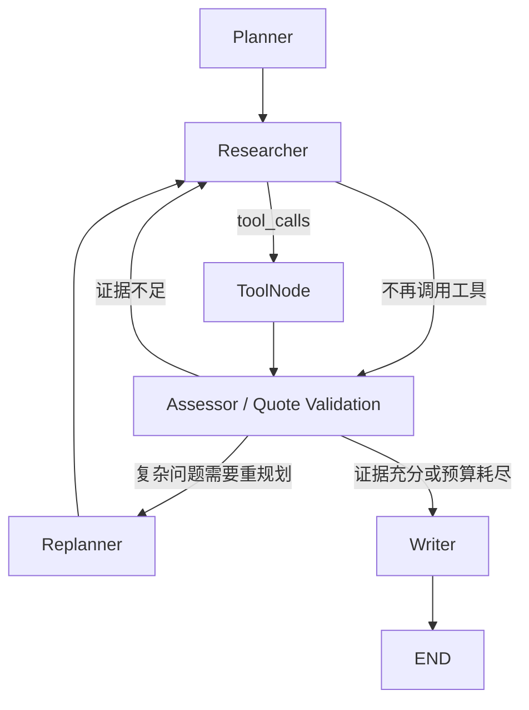

# Novel Agent

这是一个用于学习长链路 Agent 工作原理的小说证据型解读 Demo。输入一份本地小说 TXT 和一个开放式问题，Agent 会规划调查任务、搜索原文、读取上下文、记录证据、检查证据缺口、按需重规划，最后输出带原文位置的分析。


## 当前能力

- 读取 UTF-8、UTF-8-SIG、UTF-16、GB18030 等常见 TXT。
- 识别阿拉伯数字、中文数字、英文、特殊名称和无编号短标题。
- 支持同一本小说混用多种标题格式。
- 标题识别不可靠时自动按段落和长度降级切分。
- 所有 Chunk 保留行号和字符偏移，可定位回原文。
- 四个只读工具：结构查看、混合搜索、上下文读取、Section 读取。
- 小段落中文 BM25 与可选 Embedding 语义召回，通过 RRF 融合并映射回稳定 Chunk。
- 持久化上传的小说和向量索引；重启后自动恢复，Embedding 异常时自动降级。
- LangGraph 链路：Planner（简单题使用本地单任务计划）、Researcher、ToolNode、Assessor、Replanner、Writer。
- 最大调查步数、重复工具调用保护、结构化工具错误。
- 每轮最多 2 个工具、每项任务最多 2 个调查轮次和 6 条证据、最多 2 次 Replan。
- 原文引文精确校验，模型无法把不存在的引文写入证据状态。
- JSONL 执行轨迹，以及按节点汇总的输入、输出、思考与缓存 token 指标。

## Agent 图


```mermaid
flowchart TD
    A[Planner] --> B[Researcher]
    B -->|tool_calls| C[ToolNode]
    B -->|不再调用工具| E[Assessor / Quote Validation]
    C --> E
    E -->|证据不足| B
    E -->|复杂问题需要重规划| F[Replanner]
    F --> B
    E -->|证据充分或预算耗尽| G[Writer]
    G --> H[END]
```

## 环境

当前项目按 Conda `base` 环境开发和测试：

```powershell
conda activate base
python --version
python -m pip install -e .
```

如果不希望 editable 安装，也可以安装依赖后设置 `PYTHONPATH=src`。
安装后可使用 `novel-agent` 启动 Web 工作台；未安装脚本时使用：

```powershell
python -m novel_agent
```

## 模型配置

复制配置模板：

```powershell
Copy-Item .env.example .env
```

至少设置：

```dotenv
OPENAI_API_KEY=your-key
MODEL_NAME=gpt-4.1-mini
```

使用其他 OpenAI-compatible 服务时再设置：

```dotenv
OPENAI_BASE_URL=https://your-provider.example/v1
```

Thinking mode 可能不兼容本项目结构化输出使用的 named `tool_choice`。完整 Agent 流程建议关闭思考：

```dotenv
MODEL_THINKING_MODE=disabled
```

程序会按模型名和服务地址适配常见接口：千问/Qwen 发送 `enable_thinking=false`，DeepSeek、GLM、Kimi 等兼容接口发送 `thinking.type=disabled`。也可使用 `off` 或 `false`；开启时使用 `enabled`、`on` 或 `true`。设置为 `auto` 或留空时，通常不发送思考参数，但 DeepSeek 模型仍默认关闭，以保持原有兼容行为。

所选模型必须同时支持：

1. Tool Calling。
2. 使用 Tool Calling 返回结构化对象。
3. 足够长的上下文窗口。

项目默认使用 function-calling 模式生成结构化输出，以兼容更多 OpenAI-compatible 服务。
如果兼容服务偶发返回普通文本、空结果或不完整结构，程序会在同一节点内安全重试：

```dotenv
# 首次调用之外的额外尝试次数，允许 0-5，默认 2
NOVEL_AGENT_STRUCTURED_RETRIES=2
```

合法的完整 JSON 文本会在通过目标 Pydantic Schema 校验后被接受；余额、认证、限流和网络异常不会进入这层格式重试。诊断只记录节点、Schema、次数和失败类别，不保存模型原始响应。

单次聊天模型请求默认最多等待 120 秒，避免供应商连接异常时 Agent 永久停在上一个已完成节点。可按供应商延迟调整：

```dotenv
MODEL_REQUEST_TIMEOUT_SECONDS=120
```

### 混合检索配置

没有完整向量缓存时，Embedding 默认关闭，系统只使用本地中文 BM25，不会发起 Embedding 请求。要让前端开关可用，先配置供应商实际支持的模型：

```dotenv
EMBEDDING_MODEL=your-embedding-model
```

Embedding 默认复用 `OPENAI_API_KEY` 和 `OPENAI_BASE_URL`。如需使用不同供应商，可单独设置：

```dotenv
EMBEDDING_API_KEY=your-embedding-key
EMBEDDING_BASE_URL=https://your-embedding-provider.example/v1
EMBEDDING_REQUEST_TIMEOUT_SECONDS=30
```

上传小说时只同步建立约 500 字的 Passage 和 BM25 索引。没有缓存时，用户在当前小说信息栏显式开启 Embedding 后，系统才会在后台构建向量索引，并实时显示已编码片段数和百分比；开关按小说生效，同时影响 Agent 和文本检索。Embedding 每批最多发送 10 条文本以兼容千问接口，请求默认 30 秒超时。缓存写入 `output/indexes`，关闭开关不会删除缓存。服务启动或上传时若检测到当前模型对应的完整有效缓存，会自动启用该小说的 Embedding 并显示“已构建完成”，不会重新发送正文。

小说原文件和版本化 Manifest 保存在 `output/novels/<novel_id>`。服务每次启动都会恢复其中的小说并校验正文哈希；再次手动开启 Embedding 时，有效的向量缓存会直接加载，不再重复发送正文。相同正文即使文件名或编码不同也只保留一份，并返回原有 `novel_id`。可通过环境变量修改整个数据根目录：

```dotenv
NOVEL_AGENT_DATA_DIR=output
```

备份时应先停止服务，再整体复制该目录；`novels` 和 `indexes` 需要一起保留。Manifest 或原文件损坏时只会跳过对应小说，不会阻止其他小说恢复。

前端的“Embedding 消耗与检索状态”会显示文档/查询请求次数、编码文本数、输入字符数、缓存命中、失败请求和 BM25 降级次数，并保留最近 50 条安全事件。多数 OpenAI-compatible Embedding 接口不返回可靠 token 用量，因此这里明确以字符数计量，不将其标记为 token；供应商原始异常正文和凭据不会返回浏览器。

## 使用方法

### Web 图形化工作台

安装 Python 与前端依赖并构建：

```powershell
python -m pip install -e ".[dev]"
Set-Location frontend
npm install
npm run build
Set-Location ..
```

启动本机服务：

```powershell
novel-agent
```

也可以直接运行 `python -m novel_agent`。

然后访问 <http://127.0.0.1:8000>。页面支持：

- 拖拽或选择 TXT，并查看编码、章节与 Chunk 概览。
- 自动恢复已保存的小说，并在多本小说之间切换。
- 分页浏览识别出的章节结构。
- 支持降级的 BM25/Embedding 混合检索与上下文展开。
- 实时显示 Agent 节点图、调查计划、执行时间线、证据和最终答案。
- 实时展示聊天模型 input/output/reasoning/cached token、分节点耗时，以及 Agent 和检索链路的异常、重试与降级记录。
- 对超时、限流、网络和结构化输出等可恢复故障，可沿用原任务从失败节点手动重试；已完成节点、证据、时间线和用量统计不会丢失。恢复点只保存在当前服务进程内，服务重启后失效。
- 在当前模型调用结束后的节点边界安全停止任务。

### 一键启动开发环境

首次运行前，先安装 Python 依赖并在 `frontend` 目录执行一次 `npm install`。
之后脚本会同时启动 8000 端口的后端和 5173 端口的前端；按 `Ctrl+C`
会同时停止两个服务。

Windows PowerShell：

```powershell
python .\start_dev.py
```

脚本会在启动前检查 `8000` 和 `5173`。若发现监听进程，会显示端口、PID 和进程名，并询问是否终止；只有输入 `y` 或 `yes` 才会清理进程并继续，直接回车或输入其他内容会保留原进程并取消启动。无法识别 PID 时脚本不会尝试盲目清理。

Linux：

```bash
python3 start_dev.py
```

只检查 Python、npm 和前端依赖是否就绪，不启动服务：

```powershell
python .\start_dev.py --check
```

开发前端时，可分别运行后端与 Vite；`/api` 会自动代理到 8000 端口：

```powershell
# 终端 1
python -m novel_agent

# 终端 2
Set-Location frontend
npm run dev
```

## 工具

| 工具 | 作用 |
|---|---|
| `get_book_structure(section_offset, section_limit)` | 查看结构总览；章节列表可选分页，每页最多 20 条 |
| `search_novel(keyword, top_k)` | Passage 级 BM25/向量混合搜索，默认 3 条、最多 8 条 |
| `read_context(chunk_id, before, after)` | 默认仅读取命中 Chunk，最多附带前后各 1 个 Chunk |
| `read_section(section_id, start_chunk, limit)` | 默认读取 2 个 Chunk，最多 3 个 |

工具只读取本地数据，不修改小说文件。

## 状态中的关键字段

```text
messages              LangChain 消息和工具结果
plan                  结构化调查任务
current_task_id       当前调查任务
evidence              通过原文精确校验的证据
hypotheses            可被修正或拒绝的解释假设
unresolved_questions  尚未解决的问题
tool_call_history     工具、参数、结果大小/状态和去重指纹
review                最近一次证据审查结果
step_count            已使用的调查步数
termination_reason    结束原因
token_usage           按节点汇总的 token 与模型耗时
```

默认预算用于避免 Agent 在单个调查项上无限深挖：

```text
单轮工具调用上限       2
单任务调查轮次上限     2
单任务证据上限         6
全局 Replan 上限       2
```

当一个任务达到轮次上限时，有证据则以 `completed` 继续下一任务，没有证据则以 `blocked` 继续；最终 Writer 会明确披露未解决项。

`messages` 用于模型上下文，`evidence` 和 `plan` 是显式业务状态。二者不能互相替代。

## 测试

```powershell
conda activate base
python -X utf8 -m pytest

Set-Location frontend
npm test
npm run build
```

测试覆盖：

- 常见中文编码。
- 多类章节标题和混合标题。
- 无标题降级切分。
- 正文编号列表误判保护。
- 超长自然段切分。
- 搜索、上下文读取和原文引文校验。
- 小说持久化、正文去重、启动恢复和跨进程向量缓存复用。
- LangGraph 条件路由、Assessor 合并节点与简单问题快速路径。
- 使用脚本模型执行完整工具循环。
- DeepSeek 默认 Thinking mode 配置和模型 usage 元数据汇总。

测试 Fixture 在运行时动态生成，不包含小说原文。

## 项目结构

```text
src/novel_agent/
├── agent/                 LangGraph 节点、状态、路由、Prompt、Schema 与 Tool
├── application/           Web 共用的 Agent 执行服务
├── corpus/                文本加载、结构识别、切分、模型与本地查询
├── runtime/               模型配置、结构化输出与运行诊断
├── web/                   FastAPI、上传缓存、任务管理、事件映射与 SSE
├── __init__.py            精简的公开 Python API
└── __main__.py            Web 工作台启动入口

frontend/                  Vue 3 + TypeScript 单页工作台
start_dev.py               跨平台的一键开发启动脚本
tests/                     按上述职责镜像组织的后端测试
```

## 已知边界

- 任意无编号标题无法做到百分之百自动识别；系统会优先安全降级。
- 当前搜索是关键词匹配，不理解同义词；这正好用于观察 Agent 是否会主动改写查询。
- In-memory Checkpointer 只在当前进程存活，尚未实现跨进程恢复。
- 简单过程指标不是答案质量的人工或 LLM Judge 评分。
- 大模型的工具调用和结构化输出质量取决于具体供应商与模型。

建议先观察纯 ReAct 轨迹，再依次研究显式计划、证据状态、Assessor 和 Replan 对行为的影响，不要一开始增加多 Agent 或向量数据库。
