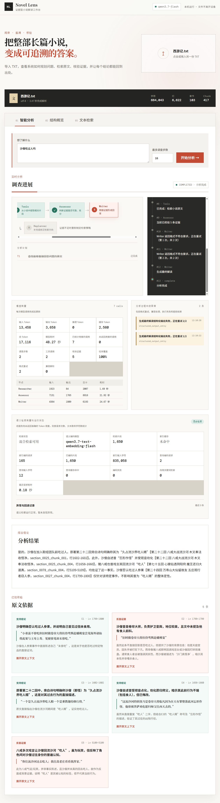
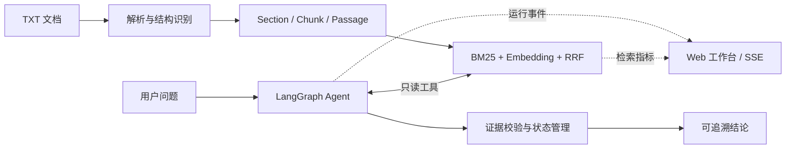
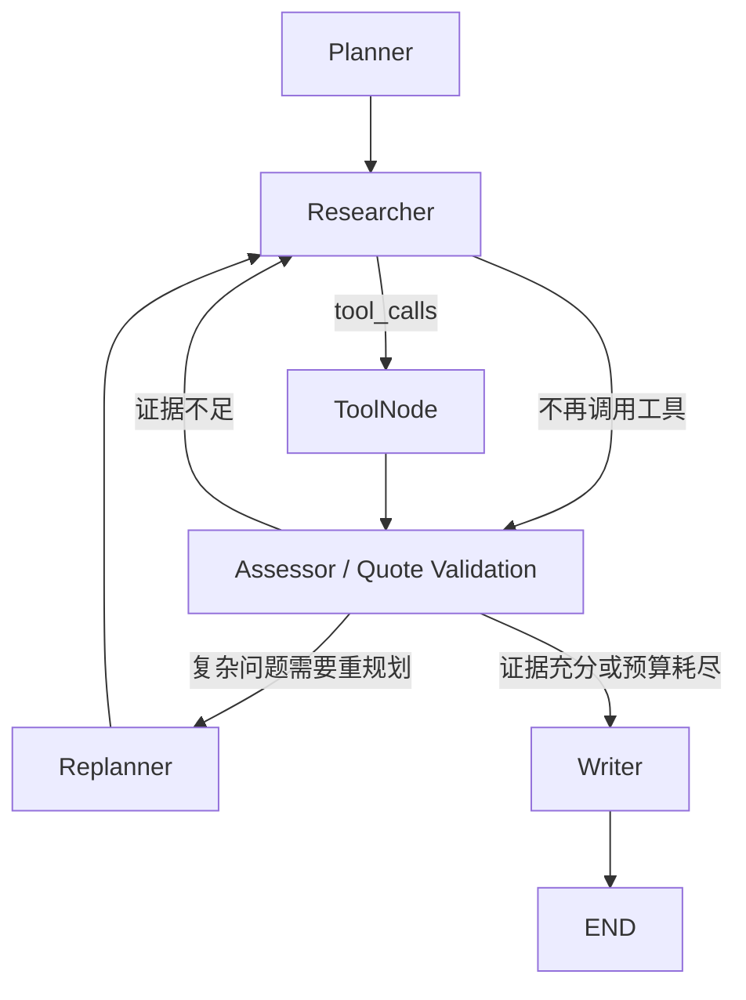

# Novel Agent

> 基于 LangGraph 的长文本证据研究 Agent 系统

Novel Agent 面向小说及其他长篇文本的深度分析场景，将文档解析、混合检索、任务规划、工具调用、证据校验和结论生成组织为一条可观测、可恢复的 Agent 工作流。上传本地 TXT 并提出开放式问题后，系统会自主拆解调查任务，检索和回读原文，持续评估证据缺口，并生成附带原文位置的分析结论。

系统以“结论可追溯、过程可观测、执行有边界”为核心：所有证据都必须通过原文精确校验，调查过程受显式预算和去重机制约束，关键节点、工具调用、模型用量、异常与降级事件均可在 Web 工作台中实时查看。





## 核心能力

### Agent 编排与推理

- 基于 LangGraph 构建 Planner、Researcher、ToolNode、Assessor、Replanner、Writer 多阶段状态图。
- 简单问题使用本地单任务计划快速执行，复杂问题由 Planner 拆解并在证据不足时动态 Replan。
- 计划、证据、假设、未解决问题和工具历史均进入显式状态，支持节点级路由与断点续跑。
- 通过最大调查步数、单任务轮次、证据数量和重复调用保护约束执行成本，避免无边界循环。

### 长文本解析与检索

- 支持 UTF-8、UTF-8-SIG、UTF-16、GB18030 等常见 TXT 编码。
- 识别阿拉伯数字、中文数字、英文、特殊名称和无编号短标题，兼容同一文本中的混合标题格式。
- 标题识别置信度不足时按段落和长度安全降级切分；所有 Chunk 保留行号与字符偏移，可精确定位原文。
- 提供结构查看、混合搜索、上下文读取和 Section 读取四类只读工具。
- 使用中文 BM25 与可选 Embedding 语义召回，通过 RRF 融合结果并映射回稳定 Chunk。

### 证据可信度与运行可靠性

- 对模型提交的引文执行原文精确校验，未出现在原文中的内容无法进入证据状态。
- 持久化小说、Manifest 与向量索引，服务重启后自动恢复并校验正文哈希。
- Embedding 不可用、超时或缓存无效时自动降级到 BM25，不阻断主调查流程。
- 结构化输出异常可在节点内安全重试；运行失败后可从最近节点恢复，保留既有计划、证据和用量数据。

### 可观测 Web 工作台

- 实时展示 Agent 节点图、调查计划、工具调用、执行时间线、证据与最终答案。
- 按节点统计模型输入、输出、思考与缓存 token，并展示耗时、异常、重试和降级记录。
- 提供小说管理、章节浏览、文本检索、Embedding 索引构建与消耗监控。
- 支持在模型调用完成后的节点边界安全停止任务。

## 系统架构

系统由文档处理、检索、Agent 编排、运行时和交互层组成。语料层负责把原始文本转换为带稳定位置的 Section、Chunk 与 Passage；Agent 通过受控只读工具访问检索层，不直接修改原始文档；运行时统一处理模型配置、结构化输出、重试与指标采集。


```mermaid
flowchart LR
    U[TXT 文档] --> C[解析与结构识别]
    C --> P[Section / Chunk / Passage]
    P --> R[BM25 + Embedding + RRF]
    Q[用户问题] --> A[LangGraph Agent]
    A <-->|只读工具| R
    A --> E[证据校验与状态管理]
    E --> O[可追溯结论]
    A -.运行事件.-> W[Web 工作台 / SSE]
    R -.检索指标.-> W
```

### Agent 执行图


```mermaid
flowchart TD
    A[Planner] --> B[Researcher]
    B -->|tool_calls| C[ToolNode]
    B -->|不再调用工具| E[Assessor / Quote Validation]
    C --> E
    E -->|证据不足| B
    E -->|复杂问题需要重规划| F[Replanner]
    F --> B
    E -->|证据充分或预算耗尽| G[Writer]
    G --> H[END]
```

## 快速开始

### 环境准备

项目要求：

- Python 3.11+
- Node.js 20.19.x 或 22.12+ 与 npm（Vite 7 的要求，仅使用后端 API 时可不安装）

安装后端与前端依赖：

```powershell
python --version
python -m pip install -e ".[dev]"
Set-Location frontend
npm install
Set-Location ..
```

复制环境变量模板并填写模型配置：

```powershell
Copy-Item .env.example .env
```

推荐开发时一键启动前后端：

```powershell
python .\start_dev.py
```

浏览器访问 <http://127.0.0.1:5173>。此模式由 Vite 提供前端热更新，并将 `/api` 代理到 <http://127.0.0.1:8000>。

> 只想先检查本机依赖是否齐全时，运行 `python .\start_dev.py --check`；该命令不会启动服务。

## 模型配置

`.env` 最少只需提供 API Key；`MODEL_NAME` 省略时使用 `gpt-4.1-mini`：

```dotenv
OPENAI_API_KEY=your-key
MODEL_NAME=gpt-4.1-mini
```

使用其他 OpenAI-compatible 服务时再设置：

```dotenv
OPENAI_BASE_URL=https://your-provider.example/v1
```

Thinking mode 可能不兼容本项目结构化输出使用的 named `tool_choice`。完整 Agent 流程建议关闭思考：

```dotenv
MODEL_THINKING_MODE=disabled
```

程序会按模型名和服务地址适配常见接口：千问/Qwen 发送 `enable_thinking=false`，DeepSeek、GLM、Kimi 等兼容接口发送 `thinking.type=disabled`。也可使用 `off` 或 `false`；开启时使用 `enabled`、`on` 或 `true`。设置为 `auto` 或留空时，通常不发送思考参数，但 DeepSeek 模型仍默认关闭，以保持原有兼容行为。

所选模型必须同时支持：

1. Tool Calling。
2. 使用 Tool Calling 返回结构化对象。
3. 足够长的上下文窗口。

项目默认使用 function-calling 模式生成结构化输出，以兼容更多 OpenAI-compatible 服务。
如果兼容服务偶发返回普通文本、空结果或不完整结构，程序会在同一节点内安全重试：

```dotenv
# 首次调用之外的额外尝试次数，允许 0-5，默认 2
NOVEL_AGENT_STRUCTURED_RETRIES=2
```

合法的完整 JSON 文本会在通过目标 Pydantic Schema 校验后被接受；余额、认证、限流和网络异常不会进入这层格式重试。诊断只记录节点、Schema、次数和失败类别，不保存模型原始响应。

单次聊天模型请求默认最多等待 120 秒，避免供应商连接异常时 Agent 永久停在上一个已完成节点。可按供应商延迟调整：

```dotenv
MODEL_REQUEST_TIMEOUT_SECONDS=120
```

### 配置项速查

| 变量 | 默认值 | 作用 |
|---|---:|---|
| `OPENAI_API_KEY` | 无 | 聊天模型凭据，运行 Agent 必填 |
| `OPENAI_BASE_URL` | 服务商默认值 | OpenAI-compatible API 地址 |
| `MODEL_NAME` | `gpt-4.1-mini` | 聊天模型名称 |
| `MODEL_THINKING_MODE` | 空（自动） | `enabled` / `disabled`；DeepSeek 默认关闭 |
| `MODEL_REQUEST_TIMEOUT_SECONDS` | `120` | 单次聊天请求超时，合法范围 5–600 秒 |
| `NOVEL_AGENT_TEMPERATURE` | `0` | 聊天模型温度 |
| `NOVEL_AGENT_MAX_STEPS` | `16` | Web 页面默认调查步数；接口最终限制为 1–100 |
| `NOVEL_AGENT_STRUCTURED_RETRIES` | `2` | 结构化输出额外重试次数，合法范围 0–5 |
| `NOVEL_AGENT_DATA_DIR` | `output` | 小说、Manifest 和向量索引的数据根目录 |
| `EMBEDDING_MODEL` | 空 | 留空时仅使用 BM25，并禁用页面上的 Embedding 开关 |
| `EMBEDDING_API_KEY` | `OPENAI_API_KEY` | Embedding 服务凭据 |
| `EMBEDDING_BASE_URL` | `OPENAI_BASE_URL` | Embedding 服务地址 |
| `EMBEDDING_REQUEST_TIMEOUT_SECONDS` | `30` | 单次 Embedding 请求超时，合法范围 5–600 秒 |

### 混合检索配置

没有完整向量缓存时，Embedding 默认关闭，系统只使用本地中文 BM25，不会发起 Embedding 请求。要让前端开关可用，先配置供应商实际支持的模型：

```dotenv
EMBEDDING_MODEL=your-embedding-model
```

Embedding 默认复用 `OPENAI_API_KEY` 和 `OPENAI_BASE_URL`。如需使用不同供应商，可单独设置：

```dotenv
EMBEDDING_API_KEY=your-embedding-key
EMBEDDING_BASE_URL=https://your-embedding-provider.example/v1
EMBEDDING_REQUEST_TIMEOUT_SECONDS=30
```

上传小说时只同步建立约 500 字的 Passage 和 BM25 索引。没有缓存时，用户在当前小说信息栏显式开启 Embedding 后，系统才会在后台构建向量索引，并实时显示已编码片段数和百分比；开关按小说生效，同时影响 Agent 和文本检索。Embedding 每批最多发送 10 条文本以兼容千问接口，请求默认 30 秒超时。缓存默认写入 `output/indexes`，关闭开关不会删除缓存。服务启动或上传时若检测到当前模型对应的完整有效缓存，会自动启用该小说的 Embedding 并显示“已构建完成”，不会重新发送正文。

小说原文件和版本化 Manifest 默认保存在 `output/novels/<novel_id>`。服务每次启动都会恢复其中的小说并校验正文哈希；再次手动开启 Embedding 时，有效的向量缓存会直接加载，不再重复发送正文。相同正文即使文件名或编码不同也只保留一份，并返回原有 `novel_id`。可通过环境变量修改小说与索引的数据根目录：

```dotenv
NOVEL_AGENT_DATA_DIR=output
```

备份时应先停止服务，再整体复制该目录；`novels` 和 `indexes` 需要一起保留。Manifest 或原文件损坏时只会跳过对应小说，不会阻止其他小说恢复。

前端的“Embedding 消耗与检索状态”会显示文档/查询请求次数、编码文本数、输入字符数、缓存命中、失败请求和 BM25 降级次数，并保留最近 50 条安全事件。多数 OpenAI-compatible Embedding 接口不返回可靠 token 用量，因此这里明确以字符数计量，不将其标记为 token；供应商原始异常正文和凭据不会返回浏览器。

## 使用方式

### 开发模式

首次运行前按“快速开始”安装依赖。启动脚本会同时运行 8000 端口的后端与 5173 端口的 Vite 前端；按 `Ctrl+C` 会停止两个服务。

Windows PowerShell：

```powershell
python .\start_dev.py
```

Linux：

```bash
python3 start_dev.py
```

脚本会在启动前检查 `8000` 和 `5173`。若发现监听进程，会显示端口、PID 和进程名，并询问是否终止；只有输入 `y` 或 `yes` 才会清理进程并继续，直接回车或输入其他内容会保留原进程并取消启动。无法识别 PID 时脚本不会尝试清理。

也可以分别启动后端与 Vite：

```powershell
# 终端 1
python -m novel_agent

# 终端 2
Set-Location frontend
npm run dev
```

### 构建后运行

后端会直接托管 `frontend/dist`。先构建前端，再启动单一服务：

```powershell
Set-Location frontend
npm run build
Set-Location ..
novel-agent
```

`novel-agent` 与 `python -m novel_agent` 等价。浏览器访问 <http://127.0.0.1:8000>，交互式 API 文档位于 <http://127.0.0.1:8000/docs>。如果未生成 `frontend/dist`，根路径会返回 503，此时应先构建前端或改用开发模式。

### Web 图形化工作台

工作台提供：

- 拖拽或选择 TXT，并查看编码、章节与 Chunk 概览。
- 自动恢复已保存的小说，并在多本小说之间切换。
- 分页浏览识别出的章节结构。
- 支持降级的 BM25/Embedding 混合检索与上下文展开。
- 实时显示 Agent 节点图、调查计划、执行时间线、证据和最终答案。
- 实时展示聊天模型 input/output/reasoning/cached token、分节点耗时，以及 Agent 和检索链路的异常、重试与降级记录。
- 对超时、限流、网络和结构化输出等可恢复故障，可沿用原任务从失败节点手动重试；已完成节点、证据、时间线和用量统计不会丢失。恢复点只保存在当前服务进程内，服务重启后失效。
- 在当前模型调用结束后的节点边界安全停止任务。

当前实现只允许全局同时运行一个 Agent 任务；新任务会在已有任务结束、失败或取消后才能创建。上传文件必须为 `.txt`，单文件上限为 50 MiB。

### 本地数据与外部请求

- 上传的 TXT、Manifest 与向量缓存分别保存在 `<NOVEL_AGENT_DATA_DIR>/novels` 和 `<NOVEL_AGENT_DATA_DIR>/indexes`，这两个目录默认位于 `output`，且已被 Git 忽略。
- Agent 调查时，问题、任务摘要以及检索到的必要原文会发送给聊天模型服务；启用 Embedding 后，系统会将全部约 500 字的 Passage 分批发送给所配置的 Embedding 服务。
- 每次 Agent 运行的 JSONL 节点轨迹写入 `output/traces/<run_id>.jsonl`。轨迹可能包含问题、工具参数、工具结果和模型输出，不应提交到版本库或公开分享。
- `NOVEL_AGENT_DATA_DIR` 当前不改变轨迹目录；备份可恢复语料和向量缓存，但不能恢复已结束或中断的 Agent 运行状态。

## 工具

| 工具 | 作用 |
|---|---|
| `get_book_structure(section_offset, section_limit)` | 查看结构总览；章节列表可选分页，每页最多 20 条 |
| `search_novel(keyword, top_k)` | Passage 级 BM25/向量混合搜索，默认 3 条、最多 8 条 |
| `read_context(chunk_id, before, after)` | 默认仅读取命中 Chunk，最多附带前后各 1 个 Chunk |
| `read_section(section_id, start_chunk, limit)` | 默认读取 2 个 Chunk，最多 3 个 |

工具只读取本地数据，不修改小说文件。

## 状态中的关键字段

```text
messages              LangChain 消息和工具结果
plan                  结构化调查任务
current_task_id       当前调查任务
evidence              通过原文精确校验的证据
hypotheses            可被修正或拒绝的解释假设
unresolved_questions  尚未解决的问题
tool_call_history     工具、参数、结果大小/状态和去重指纹
review                最近一次证据审查结果
step_count            已使用的调查步数
termination_reason    结束原因
token_usage           按节点汇总的 token 与模型耗时
```

默认预算用于避免 Agent 在单个调查项上无限深挖：

```text
单轮工具调用上限       2
单任务调查轮次上限     2
单任务证据上限         6
全局 Replan 上限       2
```

当一个任务达到轮次上限时，有证据则以 `completed` 继续下一任务，没有证据则以 `blocked` 继续；最终 Writer 会明确披露未解决项。

`messages` 用于模型上下文，`evidence` 和 `plan` 是显式业务状态。二者不能互相替代。

## 测试

```powershell
python -X utf8 -m pytest

Set-Location frontend
npm test
npm run build
```

测试覆盖：

- 常见中文编码。
- 多类章节标题和混合标题。
- 无标题降级切分。
- 正文编号列表误判保护。
- 超长自然段切分。
- 搜索、上下文读取和原文引文校验。
- 小说持久化、正文去重、启动恢复和跨进程向量缓存复用。
- LangGraph 条件路由、Assessor 合并节点与简单问题快速路径。
- 使用脚本模型执行完整工具循环。
- DeepSeek 默认 Thinking mode 配置和模型 usage 元数据汇总。

测试 Fixture 在运行时动态生成，不包含小说原文。

## 项目结构

```text
src/novel_agent/
├── agent/                 LangGraph 节点、状态、路由、Prompt、Schema 与 Tool
├── application/           Web 共用的 Agent 执行服务
├── corpus/                文本加载、结构识别、切分、模型与本地查询
├── runtime/               模型配置、结构化输出与运行诊断
├── web/                   FastAPI、上传缓存、任务管理、事件映射与 SSE
├── __init__.py            精简的公开 Python API
└── __main__.py            Web 工作台启动入口

frontend/                  Vue 3 + TypeScript 单页工作台
start_dev.py               跨平台的一键开发启动脚本
tests/                     按上述职责镜像组织的后端测试
```

## 系统边界与设计取舍

- 无编号标题具有天然歧义，无法保证完全自动识别；系统会在置信度不足时优先采用安全的段落切分策略。
- 未启用 Embedding 时仅使用 BM25 关键词召回；启用后才具备语义召回能力，并在服务异常时自动降级。
- Agent 运行恢复点使用 In-memory Checkpointer，仅在当前服务进程内有效；小说与检索索引可跨进程持久化恢复。
- 工作台中的 token、耗时和步骤统计用于运行观测，不等同于答案质量评分。
- 工具调用与结构化输出的稳定性仍受所选模型及 OpenAI-compatible 服务实现质量影响。
