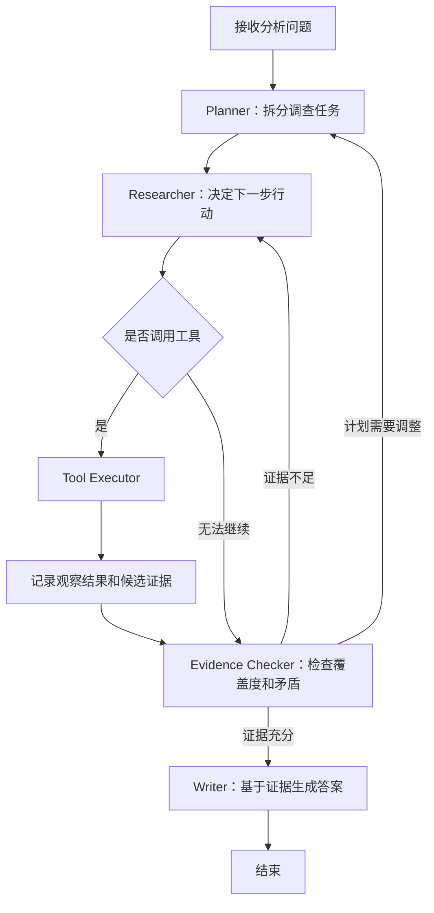
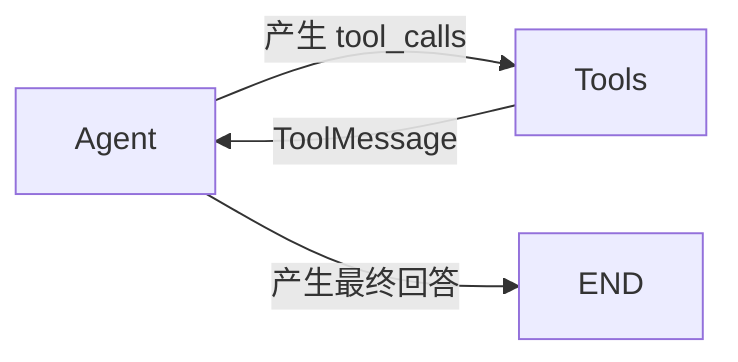
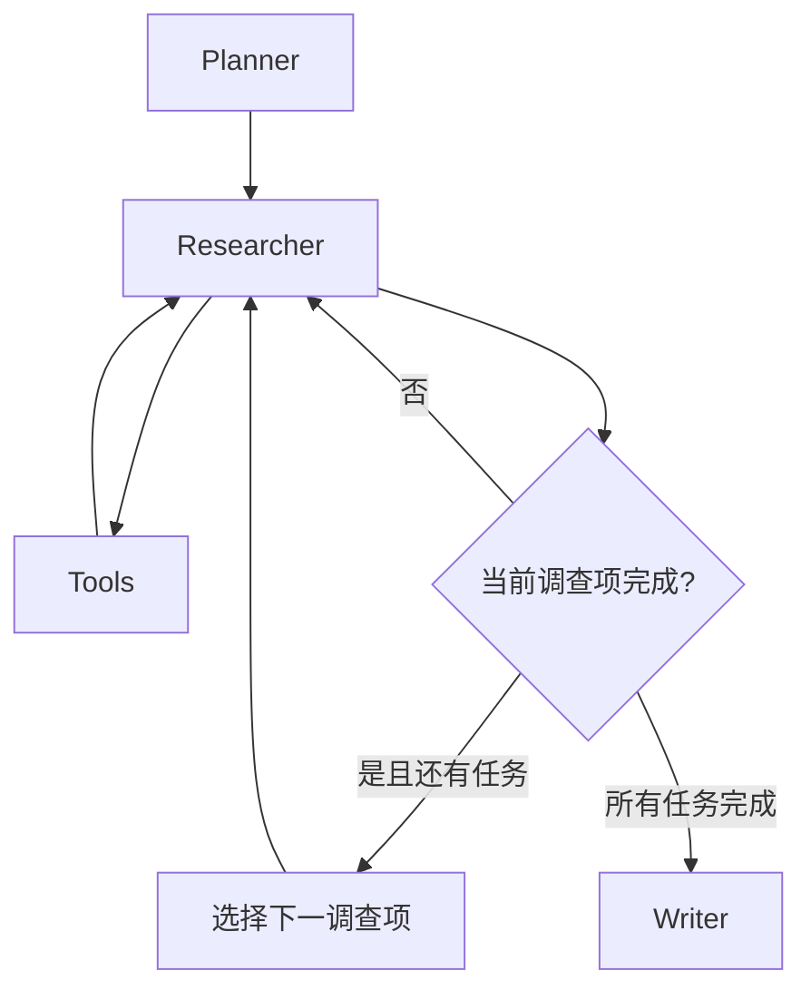
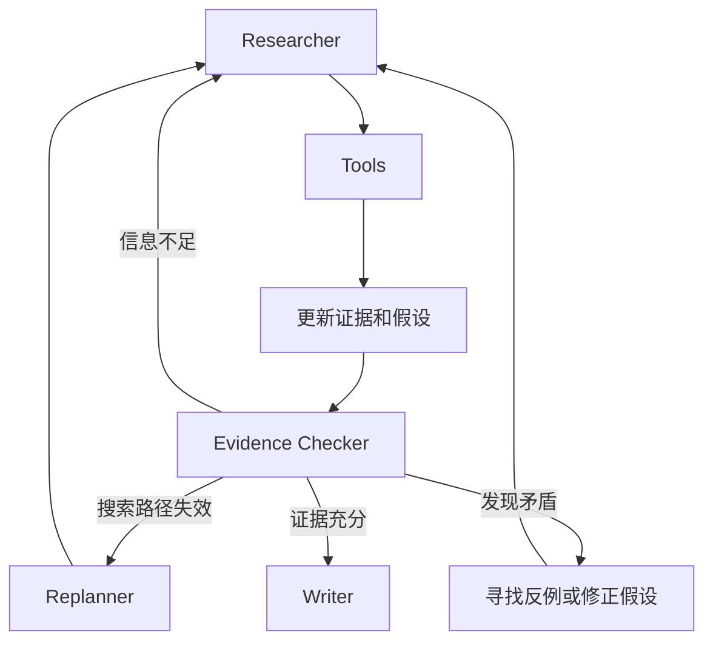

# 小说解读 Agent：渐进式设计与开发计划

## 1. 项目目标

本项目不是为了做一个功能完整的小说阅读产品，而是通过一个尽可能小的 Demo，逐步理解长链路 Agent 的核心工作原理：

1. 模型如何根据当前状态决定下一步行动。
2. 工具调用结果如何成为下一轮决策的观察信息。
3. Agent 如何在循环中补充证据、修改假设和调整计划。
4. 如何通过状态、预算和终止条件约束 Agent。
5. 如何判断 Agent 的结论是否有足够的原文依据。

最终 Demo 接收一个小说 TXT 文件和一个开放式问题，例如：

> 分析人物 A 对人物 B 的态度变化，划分主要阶段，找出关键转折点，并为每个结论提供原文依据和至少一项反面证据。

Agent 应当自主搜索小说、阅读命中位置的上下文、建立和修正假设，最后输出带章节或文本位置引用的分析。

## 2. 范围约束

### 第一阶段必须包含

- 单个小说 TXT 文件。
- 本地文本切分和关键词搜索。
- LangGraph 状态图。
- 支持 Tool Calling 的大模型。
- 可观察的逐步执行轨迹。
- 最大步数、错误处理和终止条件。
- 带原文位置的最终答案。

### 第一阶段刻意不做

- 多 Agent 协作。
- 向量数据库和复杂 RAG 框架。
- 知识图谱。
- Web 前端。
- 长期记忆。
- 自动分析任意体裁和任意格式文档。
- 对整部小说进行高质量全局摘要。

这些能力会增加工程量，却不会帮助理解最基础的 Agent 循环。

## 3. 核心心智模型

长链路 Agent 的核心不是预先定义大量节点，而是让模型在运行时反复执行：

```text
读取当前状态
    ↓
判断下一步行动
    ↓
调用工具
    ↓
获得观察结果
    ↓
更新状态
    ↓
继续行动，或者结束
```

对应小说解读场景：

```text
提出人物关系假设
    ↓
搜索相关人物或事件
    ↓
阅读命中位置的前后文
    ↓
记录支持或反对证据
    ↓
判断证据是否充分
    ↓
继续搜索、修改假设或输出结论
```

## 4. 最终目标架构



这个架构不是一开始全部实现，而是按照后续阶段逐步演进。

## 5. 技术选型

- Python 3.11 或更高版本。
- LangGraph：显式构建状态、节点和条件边。
- LangChain 的模型与 Tool Calling 接口，或模型厂商的兼容 SDK。
- Pydantic：约束计划、证据和模型输出结构。
- pytest：测试文本工具和路由逻辑。
- `charset-normalizer`：检测 TXT 编码。
- 第一版搜索：Python 字符串匹配或正则表达式。
- 后续可选搜索：BM25 或 Embedding，不作为主流程前置条件。

第一次实现时不要直接调用封装好的 `create_react_agent`。手动搭建 `StateGraph`、工具节点和条件边，更容易看清 Agent 循环。完成后可以再用预构建 Agent 做对照。

## 6. 建议目录结构

```text
novel-agent/
├── data/
│   └── novel.txt
├── src/
│   ├── config.py
│   ├── models.py
│   ├── state.py
│   ├── graph.py
│   ├── prompts.py
│   ├── novel_loader.py
│   ├── text_normalizer.py
│   ├── structure_detector.py
│   ├── chunker.py
│   ├── tools.py
│   ├── nodes/
│   │   ├── planner.py
│   │   ├── researcher.py
│   │   ├── evidence_checker.py
│   │   └── writer.py
│   └── cli.py
├── tests/
│   ├── test_novel_loader.py
│   ├── test_tools.py
│   └── test_routing.py
├── output/
│   ├── chunks.json
│   └── traces/
├── .env.example
├── requirements.txt
└── README.md
```

在阶段 0～2 可以先把代码放在少量文件中。进入阶段 3 后再按上述结构拆分，避免过早设计。

## 7. 通用 TXT 预处理与结构识别

“兼容各种 TXT”不应理解为一定能准确恢复作者原本的章节结构。TXT 没有统一的标题元数据，任意一行都可能是标题，也可能只是正文。这里的工程目标是：

1. 常见标题格式尽量识别正确。
2. 标题格式混用时仍能工作。
3. 无标题或标题无法可靠判断时自动降级。
4. 无论是否识别出章节，都能生成稳定、可搜索、可引用的 Chunk。
5. 任何清洗和切分都不破坏原文位置映射。

整体处理流水线：

```text
读取字节
  ↓
编码检测与解码
  ↓
换行、BOM、空白标准化，同时保留原文偏移映射
  ↓
按行生成标题候选
  ↓
候选评分与全局一致性检查
  ↓
高置信度标题 → 按章节/小节切分
低置信度或无标题 → 按段落和长度切分
  ↓
生成统一 Section 与 Chunk
```

### 7.1 编码与基础格式处理

读取顺序建议如下：

1. 根据 BOM 识别 UTF-8-SIG、UTF-16 LE、UTF-16 BE。
2. 严格尝试 UTF-8。
3. 使用 `charset-normalizer` 检测。
4. 中文旧文本兜底尝试 GB18030。
5. 解码失败时终止并报告，不使用 `errors="ignore"` 静默丢字。

标准化时处理：

- 将 `CRLF`、`CR` 统一为 `LF`。
- 去除文件开头 BOM。
- 识别全角空格和 Tab，但不改变正文内部的实际文字。
- 为每一行记录原文行号和全局字符偏移。
- 可以额外生成用于匹配的 `normalized_line`，但引用和展示始终使用原文。

程序启动时输出检测到的编码、字符数、行数和替换字符数量，避免乱码被误认为模型或检索问题。

### 7.2 标题候选生成

不要用一个大正则解决所有标题。实现多个独立 Detector，每个 Detector 只识别一类格式，并返回统一的候选对象。

```python
class HeadingCandidate(BaseModel):
    line_no: int
    start_char: int
    raw_text: str
    normalized_text: str
    detector: str
    number_value: int | None
    level_hint: int | None
    local_score: float
```

#### A. “第 X 章/回”类标题

支持阿拉伯数字、中文数字以及大小写混用：

```text
第1章 风雪夜归人
第 001 章 风雪夜归人
第一章 风雪夜归人
第一百二十三回 再入旧城
第十二卷
第3部 第二章
```

建议支持的单位包括：

```text
章、节、回、卷、部、篇、集、幕
```

#### B. 纯编号标题

```text
1
01
12. 风雪夜归人
12、风雪夜归人
（12）风雪夜归人
[12] 风雪夜归人
一、风雪夜归人
（十二）风雪夜归人
壹 风雪夜归人
```

纯编号很容易与列表项混淆，必须结合前后空行、标题长度、编号连续性和全书格式一致性评分，不能仅凭正则直接认定。

#### C. 英文和罗马数字标题

```text
Chapter 1
CHAPTER XII
Part Two
Book III
Volume 2
Prologue
Epilogue
```

#### D. 特殊章节名称

```text
序
序章
楔子
引子
前言
正文
终章
尾声
后记
番外
番外一
附录
```

#### E. 无编号短标题

```text
风雪夜归人
旧城
迟来的信
```

无编号标题没有可靠的格式标记，只能作为低置信度候选。可使用以下特征：

- 独占一行。
- 前后存在空行，或下一行明显是长正文。
- 长度通常在 2～30 个字符之间。
- 不以逗号、句号、问号、感叹号、分号结束。
- 标点密度低。
- 与其他候选的排版风格相似。
- 候选之间间隔较大且分布相对规律。

无编号标题宁可漏识别，也不要把大量正文误判成标题。漏识别会触发安全的长度切分，误识别则会破坏整本书的结构。

### 7.3 候选评分与全局判断

标题不能只做逐行判断，必须在全书范围判断候选集合是否合理。

建议的正向特征：

| 特征 | 示例权重 |
|---|---:|
| 明确包含“第 X 章/回”等标记 | +5 |
| 命中特殊章节名称 | +4 |
| 前后至少一侧为空行 | +1 |
| 前后两侧均为空行 | +2 |
| 标题长度为 2～30 字符 | +1 |
| 编号与前后候选连续 | +3 |
| 全书存在多个同格式候选 | +2 |
| 候选之间平均距离合理 | +1 |

建议的负向特征：

| 特征 | 示例权重 |
|---|---:|
| 行尾是逗号、句号或分号 | -3 |
| 行长度超过 60 字符 | -3 |
| 位于连续短列表中 | -2 |
| 与相邻候选距离过近 | -2 |
| 只有一个弱格式候选 | -3 |
| 编号大量逆序或重复 | -2 |

具体权重应通过实际小说样本调整，不必追求理论最优。

全局决策建议：

1. 先生成所有候选，不立即切分。
2. 按 Detector 类型和排版风格分组。
3. 计算每组候选数量、编号连续率、间距分布和格式一致性。
4. 明确标题候选可以直接保留；弱候选必须得到全局模式支持。
5. 对同一行的多个候选去重，保留置信度最高的类型。
6. 低于阈值的候选全部丢弃，而不是勉强生成章节。

建议输出结构检测报告：

```json
{
  "strategy": "mixed_headings",
  "confidence": 0.87,
  "heading_count": 128,
  "detectors_used": ["di_zhang", "special_heading", "unnumbered"],
  "rejected_candidate_count": 34,
  "fallback_used": false
}
```

### 7.4 混合标题格式

同一本小说可能同时出现：

```text
序章
第一卷 北方
第1章 出发
2、旧城
尾声
番外 雪夜
```

因此不要先判断“整本书只能属于一种标题格式”。应当：

- 允许多个高置信度 Detector 的结果合并。
- 使用行位置排序形成统一边界。
- 对“卷/部”和“章/回”保留 `level_hint`，但第一版可以统一拍平成 Section。
- 文件开头到第一个标题之间的内容保存为 `front_matter`，不能丢弃。
- 最后一个标题之后的内容正常形成最后一个 Section。
- 相邻标题之间没有正文时允许形成空的容器标题，但不要生成空 Chunk。

第一版无需实现完整的卷—章树。先拍平保存标题层级提示，检索和引用已经足够。

### 7.5 无标题文本的降级切分

以下情况都应进入降级模式：

- 没有任何标题候选。
- 只有一个低置信度候选。
- 候选密度异常高，疑似把正文或列表误判为标题。
- 编号和间距完全无规律。
- 标题检测总体置信度低于阈值。

降级切分不能简单每 2000 字截断，应优先保留语义边界：

1. 先按连续空行划分自然段。
2. 逐段累积到目标长度 1500～2000 字符。
3. 低于最小长度时继续合并下一段。
4. 超过最大长度 2500 时，优先在句号、问号、感叹号或换行处切分。
5. 如果单个自然段仍然过长，再执行硬切分。
6. 相邻 Chunk 重叠最后 1～2 个自然段，或约 150～250 字符。
7. 为降级结构生成 `section_0001`、`section_0002` 等合成 Section ID。

降级不是错误状态。对 Agent 而言，章节标题只用于改善定位和展示，检索与证据引用依然可以依赖 Chunk ID、行号和字符偏移。

### 7.6 可选的 LLM 辅助标题识别

确定性规则无法可靠识别所有无编号标题。如果确实需要提高这一类文本的识别率，可以在核心版本完成后增加一个可选步骤：

1. 规则先筛选出少量短行候选。
2. 只把候选行及其相邻少量文本交给 LLM 分类。
3. LLM 只能在现有候选中判断“标题/非标题”，不能生成新标题或修改原文。
4. 分类结果仍需通过间距、密度和全局一致性校验。
5. 记录模型、Prompt 和结果，保证预处理过程可复现。

默认关闭这一能力。标题识别不应该成为第一个 Agent 版本的主要复杂度来源。

### 7.7 统一 Section 与 Chunk 模型

不要让下游代码依赖“小说一定有章节”。统一使用更通用的 `Section`：

```python
class Section(BaseModel):
    section_id: str
    title: str | None
    title_type: str | None
    level_hint: int | None
    detected: bool
    confidence: float
    start_char: int
    end_char: int
    start_line: int
    end_line: int
```

Chunk 数据结构：

```json
{
  "chunk_id": "section_0012_chunk_003",
  "section_id": "section_0012",
  "section_title": "第十二章 旧城",
  "section_detected": true,
  "start_char": 18230,
  "end_char": 19800,
  "start_line": 531,
  "end_line": 579,
  "text": "……"
}
```

无标题文本示例：

```json
{
  "chunk_id": "section_0007_chunk_001",
  "section_id": "section_0007",
  "section_title": null,
  "section_detected": false,
  "start_char": 10400,
  "end_char": 12150,
  "start_line": 288,
  "end_line": 326,
  "text": "……"
}
```

最终答案的引用优先级：

```text
原始章节标题 + Chunk ID
否则：行号范围 + Chunk ID
最后兜底：字符偏移范围 + Chunk ID
```

这样即使标题没有识别出来，证据仍然能够精确定位。

### 7.8 Detector 接口设计

为不同标题风格定义统一接口，便于后续扩展而不修改主流程：

```python
class HeadingDetector(Protocol):
    name: str

    def detect(self, lines: list[SourceLine]) -> list[HeadingCandidate]:
        ...
```

建议的内置 Detector：

```text
DiUnitHeadingDetector       第 X 章/回/卷
NumericHeadingDetector      1、01、（12）、[12]
ChineseListHeadingDetector  一、（十二）、壹
EnglishHeadingDetector      Chapter/Part/Book/Volume
SpecialHeadingDetector      序章、楔子、尾声、番外
PlainHeadingDetector        无编号短标题，低置信度
```

主流程只负责收集候选、评分、消歧和构建 Section。

## 8. 工具设计

第一版只提供四个只读工具。

### 8.1 `get_book_structure`

返回小说总字数、Section 数量、识别到的标题、每个 Section 的 Chunk 数，以及结构检测策略和置信度。对于无标题文本，返回合成 Section，而不是假装检测到了章节。

```python
get_book_structure() -> BookStructure
```

### 8.2 `search_novel`

根据关键词搜索小说，返回命中位置和短片段。

```python
search_novel(keyword: str, top_k: int = 5) -> list[SearchHit]
```

要求：

- 限制 `top_k`，防止一次把大量原文塞入上下文。
- 返回 `chunk_id` 和命中位置。
- 关键词为空时返回结构化错误。
- 没有结果时正常返回空列表，而不是抛出异常。

### 8.3 `read_context`

读取某个命中 Chunk 及其相邻 Chunk。

```python
read_context(
    chunk_id: str,
    before: int = 1,
    after: int = 1,
) -> ContextResult
```

### 8.4 `read_section`

当 Agent 认为短片段不足以理解完整事件时，按范围读取 Section。这个接口同时适用于真实章节和无标题文本生成的合成 Section。

```python
read_section(
    section_id: str,
    start_chunk: int = 0,
    limit: int = 3,
) -> list[NovelChunk]
```

所有工具都必须返回结构化对象，并且包含错误字段。不要把 Python 异常堆栈直接交给模型。

## 9. 渐进式开发阶段

## 阶段 0：构建可验证的小说查询工具

### 学习目标

理解“工具能力决定 Agent 行动空间”。此阶段不接入大模型。

### 开发任务

1. 加载小说并处理 UTF-8、UTF-16、GB18030 等常见编码。
2. 标准化换行和空白，同时保留行号与原始字符偏移。
3. 实现多个 `HeadingDetector`，生成标题候选而不是直接切分。
4. 实现候选评分、去重、全局一致性判断和检测报告。
5. 高置信度时按标题构建 Section，低置信度时按段落和长度降级切分。
6. 在 Section 内生成稳定的 `chunk_id`。
7. 实现四个只读工具。
8. 编写一个 CLI，输出结构检测报告，并允许手动搜索和读取上下文。
9. 为编码、标题识别、降级切分、边界读取和空结果编写测试。

### 验收标准

- 有章节时能列出识别到的结构，无章节时能列出合成 Section。
- 能处理阿拉伯数字、中文数字、特殊标题、纯编号和无编号短标题。
- 同一本书混用多种标题格式时不会直接识别失败。
- 标题识别置信度低时能够自动降级，不会阻断后续检索。
- 搜索主要人物姓名可以返回正确片段。
- 能根据 `chunk_id` 读取前后文。
- 第一块和最后一块不会越界。
- TXT 使用 UTF-8、UTF-8-SIG、UTF-16 或 GB18030 时都能正确读取。
- 每条搜索结果都能定位回原文。

### 必备测试样本

至少准备以下小型 Fixture，每个文件只需几十行，不需要准备多部完整小说：

```text
numbered_arabic.txt       第1章、第2章
numbered_chinese.txt      第一章、第十二回
plain_numeric.txt         1、2、3 或 01、02、03
special_headings.txt      序章、正文、尾声、番外
unnumbered_titles.txt     独占一行的短标题
mixed_headings.txt        多种标题格式混用
no_headings.txt           完全没有标题
false_positive_list.txt   正文中包含大量编号列表
long_paragraph.txt        单段长度超过最大 Chunk
utf16_sample.txt          UTF-16 编码
gb18030_sample.txt        GB18030 编码
```

这些 Fixture 应该由测试代码动态生成，避免在仓库里复制大量小说内容。

### 此阶段要回答的问题

- 工具应该返回全文还是摘要？
- 为什么必须限制返回长度？
- 为什么工具结果必须带稳定的位置标识？

预计用时：1～2 小时。

## 阶段 1：实现最小 ReAct 循环

### 学习目标

看清最基础的 Agent 循环：模型决策、工具调用、观察结果回填、再次决策。

### 图结构



### 最小状态

```python
class AgentState(TypedDict):
    messages: Annotated[list, add_messages]
```

### 开发任务

1. 为四个工具定义 Tool Schema。
2. 创建 `agent` 节点，将工具绑定到模型。
3. 创建 `tools` 节点执行 Tool Calling。
4. 根据最后一条 AI 消息是否包含 `tool_calls` 决定路由。
5. 使用 LangGraph 的流式输出打印每一步消息。
6. 用一个简单问题跑通完整流程。

推荐的第一个问题：

> 找出人物 A 和人物 B 第一次共同出现的位置，并结合前后文说明当时两人的关系。

### 验收标准

- Agent 至少完成两次不同的工具调用。
- 工具结果以 `ToolMessage` 进入下一轮上下文。
- 模型能够根据搜索结果继续读取上下文。
- 模型在获得足够信息后自行停止调用工具。
- 控制台可以看到完整的消息序列。

### 此阶段要回答的问题

- LLM 如何决定调用哪个工具？
- 工具参数由谁生成？
- 工具结果如何进入下一轮决策？
- 最终回答与工具调用消息有什么区别？

预计用时：1～2 小时。

## 阶段 2：加入状态约束和防失控机制

### 学习目标

理解 Agent 自主性必须由确定性代码约束，不能完全依靠 Prompt。

### 状态扩展

```python
class AgentState(TypedDict):
    messages: Annotated[list, add_messages]
    step_count: int
    max_steps: int
    tool_call_history: list[dict]
    termination_reason: str | None
```

### 开发任务

1. 每轮增加 `step_count`。
2. 超过 `max_steps` 后强制结束。
3. 记录工具名、参数、结果摘要、耗时和错误。
4. 检测完全相同的连续工具调用。
5. 工具异常时返回结构化错误，允许模型重新选择行动。
6. 增加单次工具返回长度限制。

### 建议终止条件

```text
模型主动输出最终答案
或 step_count >= max_steps
或连续三次重复相同工具调用
或出现不可恢复的输入错误
```

### 验收实验

1. 搜索一个小说中不存在的人名。
2. 故意让一个 `chunk_id` 无效。
3. 把 `max_steps` 设置为 3。
4. 观察 Agent 是更换关键词、修正参数，还是被强制终止。

### 验收标准

- Agent 不会无限循环。
- 工具失败后仍然可以继续决策。
- 最终输出能区分“正常完成”和“因预算耗尽停止”。
- 能从执行日志还原每一步行动。

预计用时：1～2 小时。

## 阶段 3：加入显式计划

### 学习目标

理解 ReAct 与 Plan-and-Execute 的区别，以及显式计划如何让长任务更稳定。

### 图结构



### 状态扩展

```python
class InvestigationTask(BaseModel):
    task_id: str
    description: str
    status: Literal["pending", "in_progress", "completed", "blocked"]

class AgentState(TypedDict):
    messages: Annotated[list, add_messages]
    question: str
    plan: list[InvestigationTask]
    current_task_id: str | None
    step_count: int
    max_steps: int
```

### Planner 输出示例

问题：分析人物 A 对人物 B 的态度变化。

```json
[
  {"task_id": "T1", "description": "寻找两人早期互动", "status": "pending"},
  {"task_id": "T2", "description": "寻找关系发生变化的事件", "status": "pending"},
  {"task_id": "T3", "description": "寻找后期互动", "status": "pending"},
  {"task_id": "T4", "description": "寻找不符合主要结论的反例", "status": "pending"}
]
```

### 开发任务

1. 增加 Planner 节点，输出结构化任务列表。
2. Researcher 每次只能聚焦一个当前任务。
3. 当前任务完成后，由代码选择下一个 `pending` 任务。
4. Writer 暂时只根据消息历史生成答案。
5. 打印计划状态变化。

### 验收标准

- 复杂问题能被拆成 3～5 个调查项。
- Agent 不会只完成第一个调查项就直接回答。
- 每个任务都有明确状态。
- 执行轨迹可以看出 Agent 当前在解决哪个问题。

### 对比实验

使用同一个问题分别运行：

1. 阶段 2 的纯 ReAct Agent。
2. 阶段 3 的 Plan-and-Execute Agent。

比较两者的遗漏项、工具调用次数和最终回答结构。

预计用时：2～3 小时。

## 阶段 4：建立独立证据状态

### 学习目标

理解消息历史不等于可靠业务状态。长链路任务需要显式保存关键事实和证据。

### 证据模型

```python
class Evidence(BaseModel):
    evidence_id: str
    task_id: str
    claim: str
    quote: str
    section_title: str | None
    start_line: int
    end_line: int
    chunk_id: str
    supports: bool
    interpretation: str
```

### 状态扩展

```python
class AgentState(TypedDict):
    # 省略已有字段
    evidence: list[Evidence]
    unresolved_questions: list[str]
    coverage: dict[str, int]
```

### 开发任务

1. Researcher 从工具结果中抽取候选证据。
2. 对候选证据执行校验：引用必须原样存在于对应 Chunk。
3. 将证据与调查任务关联。
4. 分别保存支持证据和反对证据。
5. Writer 只能读取 `evidence`，不能重新自由搜索，也不能使用未记录的原文。
6. 最终答案必须标注章节标题或 `chunk_id`。

### Evidence Checker 规则

第一版使用确定性规则即可：

```text
每个主要调查任务至少有 1 条证据
至少包含 1 条反面或矛盾证据
所有引用都可以在原始 Chunk 中找到
不存在仍未解决的核心问题
```

### 验收标准

- 删除某条证据后，Checker 能发现覆盖不足。
- 模型生成不存在于原文的引文时，程序拒绝记录。
- 最终回答中的每个核心结论都关联至少一个位置标识。
- 最终 Writer 不会引用证据集合之外的文本。

预计用时：2～3 小时。

## 阶段 5：加入假设、反思和动态重规划

### 学习目标

理解 Agent 与固定 Workflow 最关键的区别：它能够根据中间观察修改后续路径。

### 假设模型

```python
class Hypothesis(BaseModel):
    hypothesis_id: str
    statement: str
    confidence: float
    supporting_evidence_ids: list[str]
    opposing_evidence_ids: list[str]
    status: Literal["active", "revised", "rejected", "accepted"]
```

### Evidence Checker 输出

```python
class ReviewResult(BaseModel):
    sufficient: bool
    missing_information: list[str]
    contradictions: list[str]
    suggested_queries: list[str]
    should_replan: bool
```

### 图结构



### 开发任务

1. 为每个核心解释建立显式假设。
2. 新证据到达后更新置信度和证据关联。
3. 连续两次搜索无结果时触发 Replanner。
4. Checker 发现矛盾时新增“验证矛盾”任务。
5. 写作前强制执行一次反例搜索。
6. 保存原计划和修改后的计划，便于对比。

### 推荐实验

故意给出一个带倾向性的问题：

> 人物 A 是否一直在利用人物 B？

观察 Agent 是否会：

- 直接迎合问题中的预设。
- 主动搜索不支持该结论的情节。
- 在发现反例后修改“一直在利用”这一假设。
- 将强结论调整为更符合证据的限定结论。

### 验收标准

- 至少发生一次关键词改写或计划调整。
- 假设能够被修正或拒绝，而不是只能新增。
- Agent 会主动寻找反例。
- 最终答案能区分确定事实、合理解释和证据不足的推测。

预计用时：3～4 小时。

## 阶段 6：加入评测与运行复盘

### 学习目标

不再只凭“答案看起来不错”判断 Agent，而是从结果和过程两个维度观察它。

### 准备测试问题

针对同一部小说手工准备 5～10 个问题：

1. 首次出场或明确事实问题。
2. 人物关系变化问题。
3. 人物动机问题。
4. 伏笔与呼应问题。
5. 带错误预设的问题。
6. 小说中没有足够证据的问题。

### 记录指标

```text
final_answer_completed       是否正常产生答案
tool_call_count              工具调用次数
unique_tool_call_ratio       非重复工具调用比例
invalid_tool_call_count      无效工具调用次数
evidence_count               有效证据数量
evidence_coverage            调查任务证据覆盖率
quote_validation_rate        引文原文校验通过率
counter_evidence_found       是否找到反面证据
replan_count                 重规划次数
termination_reason           结束原因
total_latency                总耗时
```

### 对比实验

至少比较三个版本：

| 版本 | 能力 | 观察重点 |
|---|---|---|
| V1 | 纯 ReAct | 是否容易遗漏、重复搜索 |
| V2 | ReAct + 显式计划 | 任务覆盖是否改善 |
| V3 | 计划 + 证据检查 + Replan | 结论是否更完整、更可验证 |

### 验收标准

- 每次运行都生成结构化 Trace。
- 能从 Trace 中定位失败发生在哪个节点。
- 能区分模型推理问题、工具问题和流程路由问题。
- 能用实际运行结果解释显式计划和 Replan 是否有帮助。

预计用时：2～3 小时。

## 10. 推荐开发日程

### 第 1 天：工具和最小循环

- 完成阶段 0。
- 完成阶段 1。
- 跑通一个事实型问题和一个简单解读问题。
- 重点理解 `AIMessage`、`tool_calls`、`ToolMessage` 和条件边。

### 第 2 天：约束和计划

- 完成阶段 2。
- 完成阶段 3。
- 对比纯 ReAct 与 Plan-and-Execute 的执行轨迹。
- 故意制造工具失败和搜索无结果场景。

### 第 3 天：证据管理

- 完成阶段 4。
- 确保所有原文引用都可验证。
- 将 Writer 与搜索过程解耦。
- 使用人物关系变化问题进行完整测试。

### 第 4 天：反思和重规划

- 完成阶段 5。
- 测试带错误预设的问题。
- 观察假设修改、反例搜索和 Replan。

### 第 5 天：评测和复盘

- 完成阶段 6。
- 整理 5～10 个测试问题。
- 对比三个版本的轨迹和结果。
- 写一页总结，回答“Agent 为什么不是固定 Workflow”。

如果时间有限，完成前 3 天即可掌握长链路 Agent 的主要工作原理。

## 11. 每次运行应打印的 Trace

建议每个步骤输出统一格式：

```text
[Step 04]
Node: researcher
Current task: T2 - 寻找关系发生变化的事件
Decision: call_tool
Tool: search_novel
Arguments: {"keyword": "人物B 隐瞒", "top_k": 5}
Reason summary: 上一次搜索“人物B 欺骗”无结果，改用语义更弱的事件词
Result summary: 3 hits, chapter_012_chunk_003 has highest relevance
State change: added 1 candidate evidence, remaining steps = 8
```

不要要求模型输出隐藏的完整思维过程。只记录简短、面向行动的决策说明、工具参数、观察结果摘要和状态变化。

## 12. Prompt 职责划分

### Planner

- 只负责拆解调查任务。
- 不调用工具。
- 不直接生成小说结论。
- 输出结构化计划。

### Researcher

- 一次只处理一个调查任务。
- 自主选择工具和参数。
- 搜索不到时改写关键词。
- 发现关键命中后主动读取上下文。
- 不在证据不足时提前给出最终答案。

### Evidence Checker

- 检查任务覆盖度。
- 检查是否存在反例和矛盾。
- 指出缺少什么证据。
- 决定继续调查、重规划或进入写作。

### Writer

- 只能使用已验证的证据。
- 区分原文事实和解释性判断。
- 每个核心结论必须标注原文位置。
- 证据不足时明确表达不确定性。

## 13. 常见问题与排查方向

### Agent 重复搜索同一个词

检查：

- 工具调用历史是否进入状态。
- Prompt 是否要求避免重复调用。
- 是否有代码级重复检测。
- 工具空结果是否明确返回。

### Agent 搜索一次就直接回答

检查：

- 是否有显式调查计划。
- 是否要求每个任务必须有证据。
- 是否有独立 Evidence Checker。
- 是否把“完成”完全交给模型自行判断。

### Agent 引用不存在的原文

处理方式：

- 引文必须由程序在对应 Chunk 中做精确校验。
- Writer 只能读取已验证证据。
- 引用失败时退回 Researcher 重新取证。

### Agent 找不到同义表达

第一阶段先观察它能否主动改写关键词。确认循环机制正确后，再把搜索升级为 BM25 或向量检索，不要一开始就用复杂检索掩盖 Agent 行为。

### 上下文越来越长

处理方式：

- 限制每次搜索返回数量和片段长度。
- 将原始工具结果转成结构化证据。
- 后续循环主要读取计划、证据摘要和最近消息。
- 不把整部小说或完整章节永久保存在消息历史中。

## 14. 最终完成标准

完成以下能力即可认为这个学习型 Demo 达标：

- [ ] 能加载 UTF-8、UTF-16、GB18030 等常见编码的小说 TXT。
- [ ] 能识别常见数字、中文数字、特殊名称和无编号章节标题。
- [ ] 标题格式混用或完全没有标题时仍能稳定生成 Section 与 Chunk。
- [ ] 标题识别结果包含置信度，低置信度时会自动降级而不是强行切章。
- [ ] Agent 能自主选择搜索和阅读工具。
- [ ] 工具结果会影响下一轮决策。
- [ ] Agent 能连续执行至少 5 次有意义的工具调用。
- [ ] 搜索失败后能够改写关键词或改变路径。
- [ ] Agent 有最大步骤数和重复调用保护。
- [ ] 复杂问题会被拆分成多个调查任务。
- [ ] 每个主要结论都有可验证的原文证据。
- [ ] Agent 会主动寻找反例或矛盾证据。
- [ ] 中途发现新信息时能够调整计划或修正假设。
- [ ] 最终答案明确区分事实、解释和不确定推测。
- [ ] 可以通过 Trace 复盘完整运行过程。

## 15. 完成后应能解释的问题

完成项目后，尝试不看代码回答：

1. Agent 与固定 Workflow 的本质区别是什么？
2. LangGraph 中的状态、节点和条件边分别承担什么职责？
3. 一次 Tool Calling 从生成到回填经历了什么？
4. 为什么消息历史不能替代显式业务状态？
5. Planner、Researcher 和 Evidence Checker 为什么要分开？
6. Agent 如何判断应该继续调查还是结束？
7. 如何避免无限循环、重复调用和上下文膨胀？
8. 什么情况下应该 Replan？
9. 最终答案正确时，为什么执行轨迹仍然可能是不合格的？
10. 什么时候有必要升级为多 Agent，什么时候没有必要？

如果能够结合自己的运行 Trace 回答这些问题，就已经建立了对长链路 Agent 的基本理解。

## 16. 可选扩展顺序

只有在核心版本稳定后，才按以下顺序扩展：

1. 用 BM25 改善非精确关键词搜索。
2. 增加 Embedding 语义检索，并与关键词检索对比。
3. 增加 Checkpoint，支持中断后恢复。
4. 增加人工确认节点，让用户选择是否继续深挖某条假设。
5. 增加简单的 Streamlit 执行轨迹页面。
6. 最后再尝试把 Planner、Researcher、Critic 拆成多 Agent。

扩展时每次只增加一个变量，并使用阶段 6 的测试问题比较变化，避免无法判断效果来自哪里。
